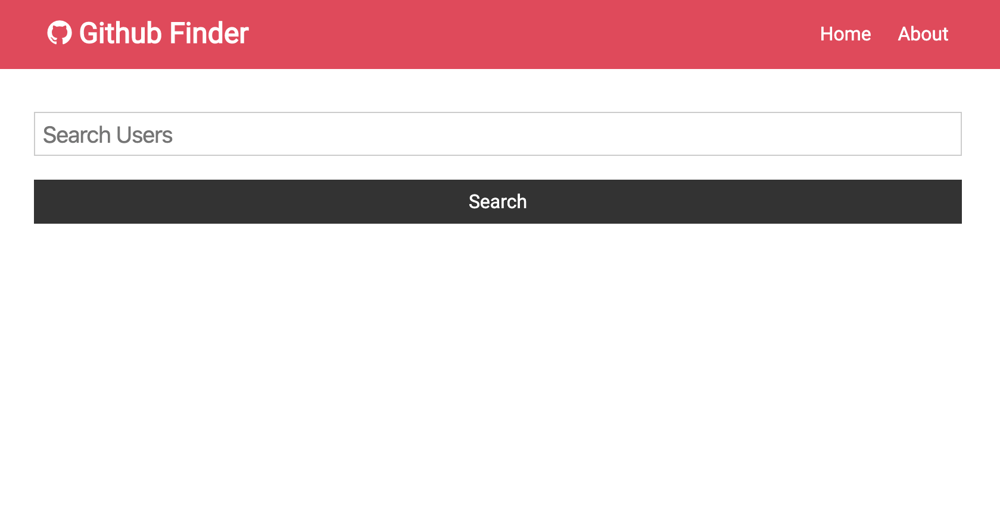

# Github User Finder

- [React](https://github.com/facebook/react/)
- [Context Api](https://reactjs.org/docs/context.html)
- [Axios](https://github.com/axios/axios)

## How to run local

1 `git clone https://github.com/MarcinMiler/instagram-clone.git`

2 `cd/github_finder/yarn`

3 `yarn start`

## Todo

- Add Pagination
- Improve UI and UX
